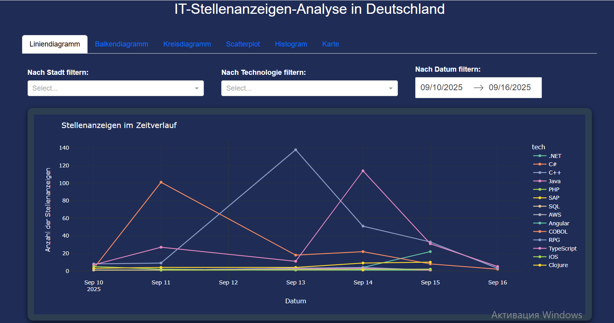
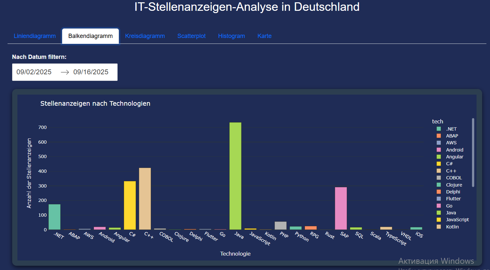
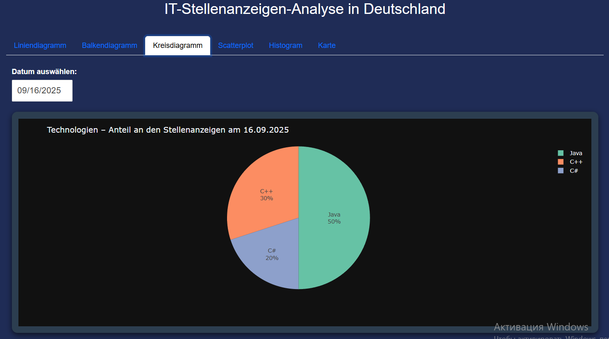
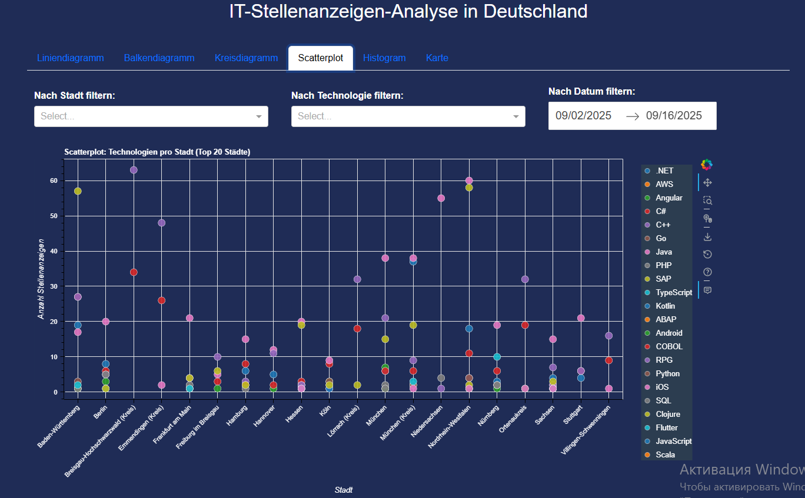
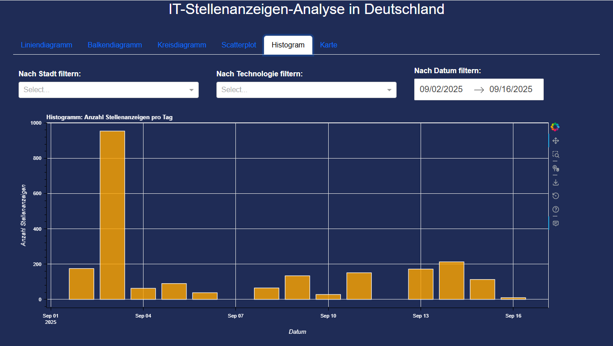
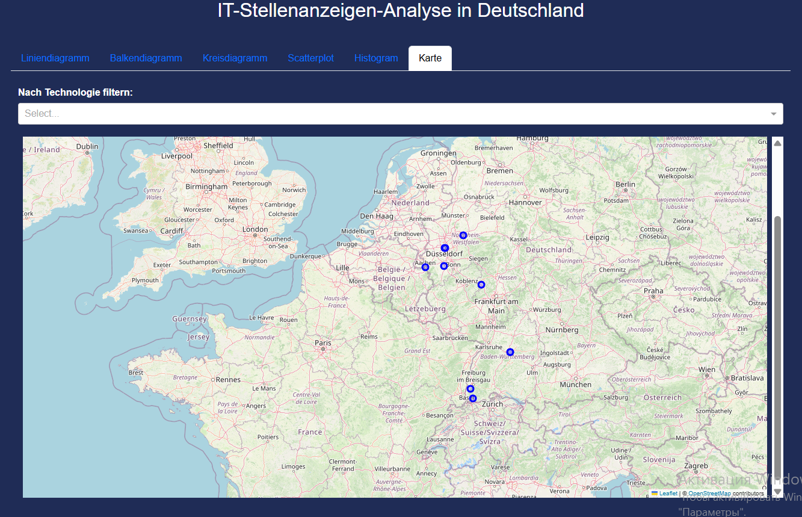

# Vacanalyzer

## Job Market Data Pipeline & Visualization

Visualisierungsmöglichkeiten is a Python-based data pipeline that automates the collection, storage, analysis, and visualization of job market data.

The project transforms raw job postings into actionable insights about technology demand, hiring trends, and geographic distribution.

Designed with a data engineering mindset, it demonstrates building a reliable ETL workflow, structured storage, and analytical visualization.

### What This Project Demonstrates

- Automated data ingestion pipeline
- Relatioнал database design & data modeling
- Data cleaning & transformation workflows
- Exploratory data analysis & visualization
- Logging, testing, and robust error handling

## Pipeline Overview

Data Acquisition
Automated import from external job data API

Storage
Structured storage in SQLite using ORM models

Processing
Cleaning, normalization, and enrichment of job data

Analysis & Aggregation
Trend detection and skill demand analysis

Visualization
Interactive and static charts for insight exploration

## Visual Insights

The system generates multiple visualization types:

- Job posting trends over time
- Most demanded technologies & skills
- Industry distribution
- Technology demand by city
- Posting frequency distribution
- Geographic job market overview

  

  

  

  

  

  

## Tech Stack

Language: Python

Data Processing:
pandas, numpy

Database:
SQLite, Peewee ORM

Visualization:
matplotlib, plotly, bokeh, folium

Quality & Reliability:
pytest • logging • exception handling • modular architecture

## Why This Project Matters

Modern labor market data changes daily. This pipeline enables continuous monitoring of hiring trends and skill demand, providing a foundation for:

- workforce analytics
- technology trend tracking
- HR decision support
- market research

## Engineering Highlights

- Automated & reproducible ETL workflow
- Clean and modular architecture
- Tested data import & transformation logic
- Structured logging for observability
- Designed for scalability and extension

## Future Enhancements

- Migration to PostgreSQL for large-scale datasets
- Cloud deployment & scheduled workflows
- Real-time dashboards
- Machine learning for demand forecasting
